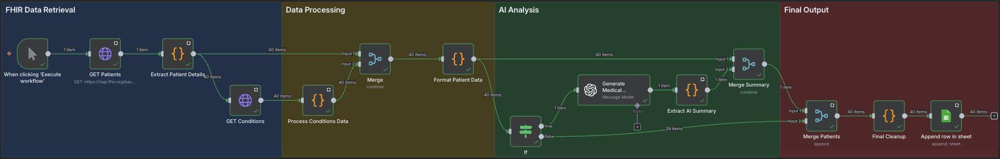

## Workflow Visualization



*The complete n8n workflow showing the four main processing stages: FHIR Data Retrieval, Data Processing, AI Analysis, and Final Output.*

# FHIR-Powered Patient Intake Summary

An automated healthcare data pipeline that retrieves patient information from FHIR APIs, processes medical conditions, generates AI-powered clinical summaries, and outputs structured data to Google Sheets for healthcare workflow integration.

## Overview

This n8n workflow demonstrates enterprise-grade healthcare data processing by:
- Fetching patient demographics and medical conditions from a public FHIR server
- Processing and cleaning FHIR data structures 
- Generating intelligent medical summaries using OpenAI GPT-4
- Preventing duplicate entries in Google Sheets output
- Handling both patients with conditions and healthy patients

## Architecture

```
FHIR API → Data Processing → AI Analysis → Google Sheets
```

### Data Flow
1. **FHIR Data Retrieval**: Extract patient demographics and conditions from HAPI FHIR server
2. **Data Processing**: Clean, merge, and structure FHIR resources 
3. **AI Analysis**: Generate medical summaries for patients with conditions using GPT-4
4. **Final Output**: Upload clean, structured data to Google Sheets

## Technologies Used

- **n8n**: Workflow automation platform
- **FHIR R4**: Healthcare data standard (HAPI FHIR public server)
- **OpenAI API**: GPT-4 for medical summary generation
- **Google Sheets API**: Data output and storage
- **JavaScript**: Custom data processing logic

## Key Features

- **Batch Processing**: Handles multiple patients efficiently with rate limiting
- **Intelligent Routing**: Only processes patients with conditions through AI analysis
- **Error Handling**: Graceful handling of missing or incomplete FHIR data
- **Duplicate Prevention**: Uses patient ID matching to avoid duplicate Google Sheets entries
- **Scalable Architecture**: Modular design supports easy modification and extension

## Sample Output

The workflow generates structured patient records with these fields:
- Patient ID
- First Name
- Last Name  
- Date of Birth
- Gender
- Medical Summary (AI-generated for patients with conditions)

### Example AI-Generated Summary
> "Patient has significant medical history composed of chronic conditions such as moderate hypertension, diabetes, and high cholesterol, which constitute primary health concerns due to elevated cardiovascular risk. Comorbid mild to moderate asthma and rheumatoid arthritis contribute to the complex health profile. Overall health status can be assessed as moderately to severely compromised."

## Setup Instructions

### Prerequisites
- n8n instance (cloud or self-hosted)
- OpenAI API key with GPT-4 access
- Google Sheets API credentials
- Access to HAPI FHIR public server (https://hapi.fhir.org)

### Installation
1. Import the workflow JSON file into your n8n instance
2. Configure credentials:
   - OpenAI API key in "Generate Medical Summary" node
   - Google Sheets OAuth in "Upload to Spreadsheet" node
3. Update Google Sheets document ID in the final node
4. Execute the workflow

### Configuration Options
- Adjust patient count in "GET Patients" node (default: 40)
- Modify batch size in "GET Conditions" node for rate limiting
- Customize AI prompt in "Format Patient Data" node
- Change output columns in Google Sheets node

## Workflow Components

### FHIR Data Retrieval (Blue Section)
- **Manual Trigger**: Initiates workflow execution
- **GET Patients**: Retrieves patient demographics from FHIR server
- **Extract Patient Details**: Parses FHIR Patient resources
- **GET Conditions**: Fetches medical conditions for each patient

### Data Processing (Yellow Section) 
- **Process Conditions Data**: Cleans and structures FHIR Condition resources
- **Merge**: Combines patient demographics with condition data
- **Format Patient Data**: Prepares data for AI analysis and output

### AI Analysis (Green Section)
- **If Node**: Routes patients with conditions to AI processing
- **Generate Medical Summary**: OpenAI GPT-4 medical summary generation
- **Extract AI Summary**: Processes OpenAI responses
- **Merge Summary**: Combines AI summaries with patient data

### Final Output (Purple Section)
- **Merge Patients**: Consolidates all patient records
- **Final Cleanup**: Removes unnecessary fields for clean output
- **Upload to Spreadsheet**: Appends data with duplicate prevention

## Healthcare Compliance Notes

- Uses anonymized public FHIR test data
- AI summaries are for demonstration purposes only
- Not intended for production medical use without proper validation
- Follows FHIR R4 standards for healthcare data interoperability

## Technical Highlights

- **FHIR Standard Compliance**: Proper parsing of healthcare data standards
- **API Rate Limiting**: Handles FHIR server constraints with batch processing
- **Error Resilience**: Continues processing when patients have no conditions
- **Data Integrity**: Prevents duplicates and maintains referential integrity
- **Modular Design**: Each section can be modified independently

---

*Built for healthcare technology demonstration - showcasing API integration, data processing, AI implementation, and workflow automation skills.*
